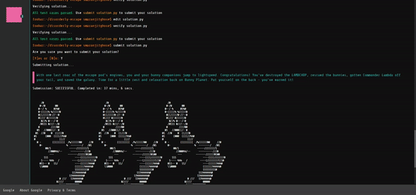

<h1 align= "center"><b>Foobar Challenge </b></h1>

The Foo bar challenge by Google is a known in the dev community to be a secret way Google shortlists developers.

<p align="center"></p>

Now, there are several ways for getting an invite. For some of us it may be random based on our search history. For others, it can be triggered. The following video by [Aaishika](https://github.com/aaishikasb) provides a nice walthrough for this:

[](https://www.youtube.com/watch?v=zINg12v7cq4)


If Google still hires through this process or not is a mystery. However, the problems were really nice for practicing one's coding skills.
<p align="center"></p>


##### __Please note: This repository is purely for educational purposes. We do not claim any responsibility for any misuse of this!__


<h2 align= "center"><b>Instructions for a headstart</b></h2>
<p align="center"></p>

- When you get the invite and accept it, __do not forget to sign in__. Otherwise, if you close that tab, your session will be saved. And even you open the same link again, you won't be able to access it

- A list shell of commands that help you to navigate through their UNIX terminal like window:
<p align="center"></p>

**No other shell commands work other than these**

- You can either use Java or Python 2.7 to solve the problems

- Every time you want to solve a new problem, type ```request``` and then press ```Y```. A problem is fetched within a few seconds and a  timer is started for that problem.( The time alloted depends on the level you are at. The min is 48 hours)

- __Note: The timer is still running in the background even if you close the particular tab or window and revisit later on__

- To check if you got the problem, type ```ls``` (Typically the problem statement and the other files for it is fetched inside a dedicated folder)

- __Note: Google allows you to have only problem at a time. You cannot request another problem, unless you have solved the current one__

- Now move inside the folder using ```cd name-of-the-problem```

- Typically you'll see there are 4 files by doing ```ls```
    - readme.txt : Contains the problem statement
    - constraints.txt : Contains the contraints of the given problem statement
    - solution.py: The file where you can write your solution in Python
    - solution.java: The file where you can write your solution in Java
    
- To view the problem statement type ```cat readme.txt```

- To start solving using Python(my personal preferrence) or Java, type ```edit solution.py``` or ```edit solution.java```

- Now an editor pops up towards the right of the screen

- Solve the question here or do some trials in an editor like [VSCODE](https://code.visualstudio.com/download) and paster your solution here 

- Remember: The python solutions are to be written in Python 2.7 and not Python 3. You can use an online compiler to change the version and test it

- __Note: You should not change the name of the function while you write your solution here otherwise it won't run__

- Press ```CTRL+S``` to save your changes

- Now press ```CTRL+E``` to exit the editor

- To test your solution on the given test cases (including hidden ones), type ```verify solution.py``` or ```verify solution.java```

- If all of your test cases are satisfied, submit by typing ```submit solution.py``` or ```submit solution.java```

<h2 align= "center"><b> Questions </b></h2>

<p align="center"></p>


The challenge is divided into 5 levels of increasing difficulty. The number of questions in each level are:
- Level 1: 1 question
- Level 2: 2 question
- Level 3: 3 question
- Level 4: 2 questions
- Level 5: 1 question

It's hilarious that Google has a palindrome hidden here as "12321" 🤣

Nevertheless, here is a collection of questions and their accepted solutions majority of people have encountered. 

##### __Please note: This repository is purely for educational purposes. The solutions given below are what worked for us and there might be even more efficient ones possible. We do not claim responsibility for any misuse of this!__


### Level 1: 

| Problem | Solution(s) |
|---------|-------------|
| [I Love Lance and Janice](Problems/i_love_lance_and_janice.MD) | [Solution](Solutions_Python/i_love_lance_and_janice.py) |
| [* Prison Labor Dodgers](Problems/prison_labor_dodgers.MD) | [Solution](Solutions_Python/prison_labor_dodgers.py) |
| [** Braille Translation](Problems/braille_translation.MD) | [Solution](Solutions_Python/braille_translation.py) |
| [*** Minion Labor Shifts](Problems/minion_labor_shifts.MD)| [Solution](Solutions_Python/minion_labor_shifts.py) |

### Level 2: 

| Problem |Solution(s)|
|---------|-----------|
| [Please Pass the Coded Messages](Problems/please_pass_the_coded_messages.MD) | [Solution](Solutions_Python/please_pass_the_coded_messages.py) |
| [Numbers Station Coded Messages](Problems/number_station_coded_messages.MD) | [Solution](Solutions_Python/number_station_coded_messages.py) |
| [* Hey I already did that](Problems/number_station_coded_messages.MD) | [Solution](Solutions_Python/hey_i_already_did_that.py)|
| [** Power Hungry](Problems/power_hungry.MD) | [Solution](Solutions_Python/power_hungry.py)|
| [**** Lovely Lucky Lambs](Problems/lovely_lucky_lambs.MD) | [Solution](Solutions_Python/lovely_lambs.py)|

### Level 3: 

| Problem | Solution(s) |
|---------|-------------|
| [Queue To Do](Problems/queue_to_do.MD) | [Solution](Solutions_Python/queue_to_do.py) |
| [The Grandest Staircase of them All](Problems/the_grandest_staircase_of_them_all.MD) | [Solution](Solutions_Python/the_grandest_staircase_of_them_all.py) |
| [Find the Access Codes](Problems/find_access_codes.MD) | [Solution](Solutions_Python/find_the_access_codes.py) |
| [* Fuel Injection Perfection](Problems/fuel_infection_perfection.MD) | [Solution](Solutions_Python/fuel_injection_perfection.py) |
| [* Bomb Baby](Problems/bomb_baby.MD) | [Solution](Solutions_Python/bomb_baby.py) |
| [** Doomsday Fuel](Problems/doomsday_fuel.MD) | [Solution](Solutions_Python/doomsday_fuel.py) |
| [*** Prepare the bunnies escape](Problems/prepare_the_bunnies_escape.MD) | [Solution](Solutions_Python/prepare_the_bunnies_escape.py)|

### Level 4: 

| Problem | Solution(s) |
|---------|-------------|
| [Bringing Gun to Guard Fight](Problems/bringing_gun_to_guard_fight.MD)  | [Solution](Solutions_Python/bringing_gun_to_a_guard_fight.py) |
| [Running with the bunnies](Problems/running_with_bunnies.MD) | [Solution](Solutions_Python/running_with_the_bunnies.py)|
| [* Escape Pods](Problems/escape_pods.MD) | [Solution](Solutions_Python/escape_pods.py)|
| [** Free the Bunny Prisoners](Problems/free_the_bunny_prisoners.MD) | [Solution](Solutions_Python/free_the_bunny_prisoners.py)|


### Level 5: 

| Problem | Solution(s) |
|---------|-------------|
| [Disorderly Escape](Problems/disorderly_escape.MD) | [Solution](Solutions_Python/disorderly_escape.py)|
| [** Expanding Nebula](Problems/expanding_nebula.MD) | [Solution](Solutions_Python/expanding_nebula.py)|
| [^ Dodge the Lasers](Problems/dodge_the_lasers.MD) | [Solution](Solutions_Python/dodge_the_lasers.py)|
<p align="center"></p>

<h2 align= "center"><b>Problems Contributed by:</b></h2>

- [* Sukkrit Sharma](https://github.com/sukkritsharmaofficial)
- [** Suhrid Datta](https://github.com/suhriddatta)
- [*** Aaishika Bhattacharya](https://github.com/aaishikasb)
- [**** Somesh Koli](https://github.com/someshkoli) 
- [^ Aditya Jyoti Paul](https://github.com/phreakyphoenix) 
