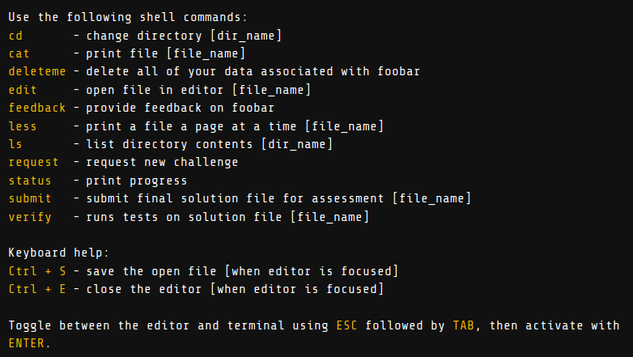

<h1 align= "center"><b>Foobar Challenge </b></h1>


The Google Foo bar challenge is a known in the dev community to be a secret way Google shortlists developers. However, the way it works and the end result is not transparent yet.

<p align="center"></p>

While debugging an error in a  personal project of mine, I suddenly got a invite for this.

<p align="center"></p>

And I tuned in to explore it.


<p align="center"></p>


__I cannot suggest a guranteed way to get this or if actually Google is going to hire you via this process.__

<p align="center"></p>

However, the problems were really nice and beautifull distributed across 5 levels of difficulty.

This repo is meant to provide you a taste of the problems I was given so that you can practice and hone your skills further!

__Please note I do not claim any problems to be owned by me and the solutions given below are what worked for me and there might be even more efficienct ones out there__

<p align="center"></p>


<h2 align= "center"><b> Suggestions and Solutions </b></h2>

<p align="center"></p>

##### Some suggestions for a headstart(if you get invited for this):

- A list shell of commands that help you to navigate through their UNIX terminal like window:

<p align="center"></p>

**No other shell command works other than these

- You can either use Java or Python to solve the problems

- Every time you want to solve a new problem, type ```request``` and then press ```Y```. A problem with a dedicated timer will be fetched( The time alloted depends on the level you are at. The min is 48 hours)

- Now move inside the folder using ```cd name-of-the-problem```

- Typically you'll see there are 4 files by doing ```ls```
    - readme.txt : Contains the problem statement
    - constraints.txt : Contains the contraints of the given problem statement
    - solution.py: The file where you can write your solution in Python
    - solution.java: The file where you can write your solution in Java
- To view the problem statement type ```cat readme.txt```
- To start solving using Python(my personal preferrence) or Java, type ```edit solution.py``` or ```edit solution.java```
- Now an editor pops up towards the right of the screen
- Keep in mind that you should not change the name of the function while you give your solution here
- Press ```CTRL+S``` to save and ```CTRL+E``` to exit the editor
- To test your solution on the given test cases (including hidden ones), type ```verify solution.py``` or ```verify solution.java```
- If all of your test cases are satisfied, submit by typing ```submit solution.py``` or ```submit solution.java```


### Level 1: 

| Problem | Solution |
|---------|----------|
|         |          |

### Level 2: 

| Problem | Solution |
|---------|----------|
|         |          |

### Level 3: 

| Problem | Solution |
|---------|----------|
|         |          |

### Level 4: 

| Problem | Solution |
|---------|----------|
|         |          |

### Level 5: 

| Problem | Solution |
|---------|----------|
|         |          |